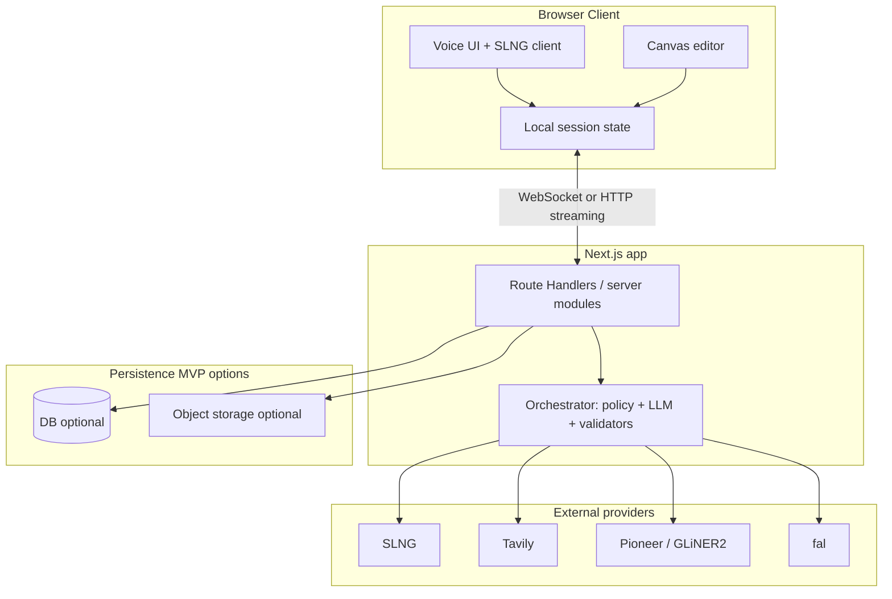
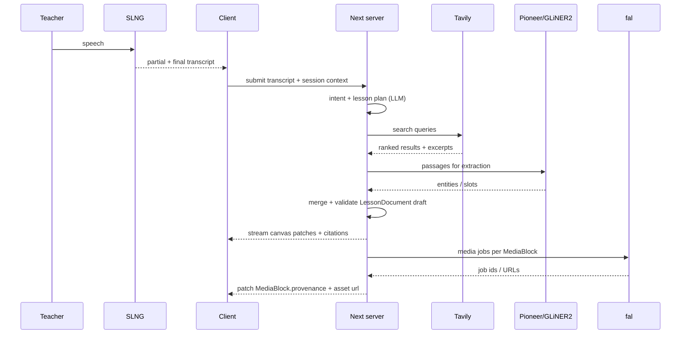
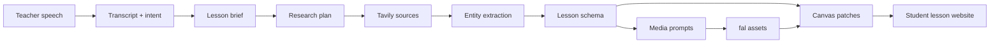
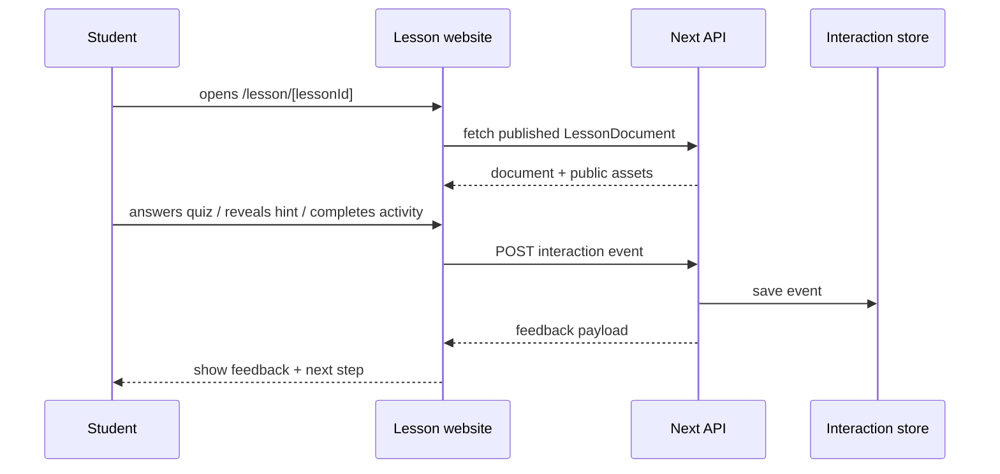
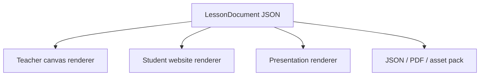

# Canvas Teacher AI — technical specification

**Repository:** `next-learning`  
**Document type:** technical architecture & product spec (hackathon-oriented)  
**Stack (current):** Next.js **16.2**, React **19.2**, TypeScript **5**, Tailwind **v4**, Biome via Ultracite, **pnpm**, Lefthook  
**App entry:** `src/app/` (App Router)

This document is the **authoritative technical description** of the intended system. The codebase is still a scaffold; sections marked **Target** describe what to build, not what exists today.

---

## 1. Purpose & audience

### 1.1 Purpose

Align engineering, integrations, and judging criteria around a **voice-first** workflow that produces a **structured, editable multimedia lesson** on a canvas—not a static chat transcript.

### 1.2 Audience

- Implementers (frontend, backend, ML glue)
- Hackathon reviewers (clarity of architecture and provider usage)
- Future maintainers (constraints, tradeoffs, extension points)

### 1.3 Out of scope (unless explicitly added later)

- Full LMS integration (Google Classroom, Canvas LMS product, etc.)
- Multi-teacher realtime collaboration on one canvas (possible stretch; not assumed)
- Student identity management at scale
- Offline-first mobile native apps

---

## 2. Product definition

### 2.1 Working name

**Canvas Teacher AI**

### 2.2 One-liner

A voice-first AI web application that helps teachers create **editable multimedia teaching content** by speaking naturally.

### 2.3 Core loop (teacher experience)

1. **Speak** a lesson intent (topic, level, duration, constraints).
2. **Listen** to confirmations, clarifying questions, or summaries (voice + optional text).
3. **Observe** the canvas filling with blocks: objectives, explanations, media, activities, citations.
4. **Edit** any block (text, layout, replace media, tweak quiz items).
5. **Export or share** (format TBD: JSON bundle, PDF snapshot, link—see §10).

### 2.4 Canvas contents (first-class nodes)

| Category      | Examples                                                       | Notes                                                       |
| ------------- | -------------------------------------------------------------- | ----------------------------------------------------------- |
| Pedagogy      | Learning objectives, key takeaways, pacing / segments          | Should map to stable IDs for reordering                     |
| Narrative     | Rich text, callouts, vocabulary                                | Markdown or portable JSON; avoid vendor lock-in             |
| Media         | Images, short video clips, diagrams                            | Store **provenance** (model, prompt hash, provider job id)  |
| Interactivity | Activities, quizzes (MCQ, short answer), “check understanding” | Separate **content** from **runtime** (how it is presented) |
| Evidence      | References, quotes, “further reading”                          | Must retain **URLs + retrieved snippets** for trust         |

### 2.5 Provider roles (integration matrix)

| Provider                        | Capability               | Responsibility in this product                                                                         |
| ------------------------------- | ------------------------ | ------------------------------------------------------------------------------------------------------ |
| **SLNG**                        | STT, TTS, realtime voice | Primary **human interface**; low-latency feedback; partial transcripts for UI                          |
| **Tavily**                      | Web-aware search         | Retrieve **fresh** supporting material; reduce model hallucination for factual subjects                |
| **Pioneer (Fastino) / GLiNER2** | Structured extraction    | Turn unstructured text (teacher + search results) into **typed entities** aligned to the lesson schema |
| **fal**                         | Generative media         | Produce **images/video** assets bound to specific canvas nodes                                         |

**Design principle:** each provider does what it is best at; **orchestration** (likely an LLM + deterministic validators on the server) merges outputs into one **canonical lesson document** (§6).

---

## 3. Goals, non-goals, and quality attributes

### 3.1 Goals (ordered)

1. **Voice-first usability:** teacher can complete a meaningful lesson draft without typing (typing is optional enhancement).
2. **Structured output:** downstream UI can render and edit without scraping Markdown blobs.
3. **Grounding:** citations and search snippets visible where claims need support.
4. **Editability:** every generated block is mutable; regenerating one block should not destroy unrelated content.
5. **Provider fidelity:** judges can see **clear boundaries**—when Tavily was called, what was extracted, what media job produced which asset.

### 3.2 Non-goals (hackathon realism)

- Perfect WYSIWYG parity with commercial authoring tools
- Full accessibility certification (still follow basics: keyboard, captions where video, ARIA on custom controls)
- Exhaustive subject-specific pedagogical templates on day one

### 3.3 Quality attributes

| Attribute            | Target                            | Implementation lever                                                                    |
| -------------------- | --------------------------------- | --------------------------------------------------------------------------------------- |
| **Latency (voice)**  | Perceived continuous conversation | Streaming STT; short TTS replies; async canvas updates                                  |
| **Latency (canvas)** | Progressive disclosure            | Render “skeleton blocks” immediately; fill media as jobs complete                       |
| **Reliability**      | Partial success is acceptable     | Per-node job status: `pending` / `ready` / `failed` with retry                          |
| **Safety**           | Teacher-facing                    | Server-side tool allowlists; URL validation; optional moderation pass on generated text |
| **Auditability**     | Demo-friendly                     | Persist `GenerationRun` metadata: prompts, queries, timestamps, provider ids            |

---

## 4. Personas & critical journeys

### 4.1 Primary persona: classroom teacher

- Expert in subject; limited time; wants **materials** not a chatbot.
- May speak in **fragments**, revise verbally (“actually for grade 9, not 10”).

### 4.2 Secondary persona: instructional coach / curriculum lead

- Cares about **objectives alignment**, citations, and reuse across classes.

### 4.3 Critical journeys

**J1 — Happy path generation**

Speak intent → clarifying questions (if needed) → Tavily searches → extraction/schema merge → fal jobs for visuals → canvas populated → teacher tweaks text.

**J2 — Correction loop**

Teacher selects a block → “regenerate this image / simplify this paragraph” → single-node pipeline re-run without full lesson rebuild.

**J3 — Trust check**

Teacher opens “sources” drawer on a factual block → sees Tavily hits + excerpts + links.

---

## 5. System architecture

### 5.1 Logical view



**Rationale:** secrets and provider orchestration stay **server-side** (`Route Handlers`, server actions, or dedicated server modules). The browser holds **session UI state** and **references** to assets; it never holds provider API keys.

### 5.2 Deployment view (default assumption)

- **Vercel** (or compatible) for Next.js hosting.
- **Media:** fal-hosted URLs or your object storage with signed URLs—decide per asset lifetime requirements.

### 5.3 Voice vs canvas coupling

- **Tight coupling at UX:** teacher should see partial STT and which block is “targeted.”
- **Loose coupling at code:** voice session state machine ≠ canvas document reducer; bridge via explicit events (`IntentRecognized`, `ClarificationNeeded`, `LessonPatchProposed`).

---

## 6. Domain model (canonical lesson document)

### 6.1 Design criteria

- **JSON-serializable** for export, undo stacks, and AI patching.
- **Stable `id`s** on every node (UUID v4 or ULID).
- **`schemaVersion`** on the root for migrations.
- **Separation:** `LessonDocument` (content tree) vs `GenerationRun` (provenance logs).

### 6.2 Illustrative type sketch (TypeScript-ish, not implemented)

```typescript
type NodeId = string;

type BaseNode = {
  id: NodeId;
  type: string;
  title?: string;
  children?: NodeId[];
  style?: Record<string, unknown>;
};

type TextBlock = BaseNode & {
  type: "text";
  format: "markdown" | "plain";
  body: string;
};

type MediaBlock = BaseNode & {
  type: "media";
  modality: "image" | "video";
  alt: string;
  asset: { url: string; mime: string; width?: number; height?: number };
  provenance: {
    provider: "fal";
    model?: string;
    jobId?: string;
    prompt?: string;
    createdAt: string;
  };
};

type Citation = {
  id: string;
  url: string;
  title?: string;
  excerpt: string;
  retrievedAt: string;
  provider: "tavily";
};

type QuizBlock = BaseNode & {
  type: "quiz";
  items: Array<{
    id: string;
    stem: string;
    choices?: string[];
    answer?: string;
  }>;
};

type LessonDocument = {
  schemaVersion: 1;
  root: NodeId;
  nodes: Record<NodeId, TextBlock | MediaBlock | QuizBlock | BaseNode>;
  citations: Citation[];
};
```

**Note:** real implementation should use discriminated unions + Zod (or similar) for runtime validation at API boundaries.

### 6.3 Patch semantics (for AI + user edits)

Prefer **JSON Patch** or a small custom op log:

- `AddNode`, `UpdateNode`, `MoveNode`, `DeleteNode`, `SetMediaStatus`

Benefits: targeted regeneration, easier undo, clearer concurrency story than “replace whole JSON.”

---

## 7. Pipelines & orchestration

### 7.1 Orchestration philosophy

Use a **hybrid** approach:

1. **Deterministic** steps: validate URLs, normalize citations, enforce max sizes, attach provider job ids.
2. **Model-driven** steps: turn speech + context into search queries; map extracted entities into nodes; author quiz stems.

Guardrails: **schema validation** after every model step; repair loop (single retry) on validation failure.

### 7.2 Sequence: end-to-end generation (target)



### 7.3 Tavily integration (technical considerations)

- **Query planning:** separate queries for “definitions”, “examples”, “common misconceptions”, “classroom activities.”
- **Deduplication:** canonicalize URLs; merge overlapping excerpts.
- **Safety:** fetch only `https:`; block private IP ranges if any redirect risk; cap response size.
- **Caching:** short TTL cache keyed by query hash to survive demo retries.

### 7.4 Pioneer / GLiNER2 integration

- **Input:** bounded text (teacher transcript + selected Tavily excerpts), not the whole web.
- **Output contract:** map to **slots** in your schema (e.g., `VocabularyTerm[]`, `KeyConcept[]`, `Misconception[]`).
- **Failure mode:** if extraction is thin, fall back to LLM-only structuring but **flag** lower confidence in UI.

### 7.5 fal integration

- **Async first:** return `jobId`, show spinner on node; complete with URL.
- **Idempotency:** tie job request to `MediaBlock.id` + `prompt` hash to avoid duplicate spend on retries.
- **Formats:** prefer formats the canvas can preview (mp4/h264 for video; webp/png for images).
- **Rights:** surface that media is **AI-generated** in provenance metadata (and UI where appropriate).

### 7.6 SLNG integration

- **Modes:** push-to-talk vs always-on—start with push-to-talk for cleaner demos.
- **Barge-in:** if supported, cancel in-flight TTS when user speaks.
- **Client audio:** use browser APIs with explicit permission UX; echo cancellation notes for laptop mics.
- **Transcript ownership:** store transcript segments in `GenerationRun` for reproducibility.

### 7.7 Detailed lesson generation flow

The core technical challenge is not “generate text.” It is turning a loose spoken request into a **teachable, inspectable, interactive website**. The pipeline should be staged so every stage produces a typed artifact that the next stage can validate.



| Stage                       | Input                  | Output                                          | Why it matters                                                                       |
| --------------------------- | ---------------------- | ----------------------------------------------- | ------------------------------------------------------------------------------------ |
| **1. Voice capture**        | Teacher speech         | Transcript segments with timestamps             | Keeps the product voice-first and auditable.                                         |
| **2. Intent parsing**       | Transcript             | `LessonBrief`                                   | Converts natural language into constraints: topic, grade, duration, language, style. |
| **3. Research planning**    | `LessonBrief`          | Tavily query set                                | Searches should be purposeful, not one generic query.                                |
| **4. Source retrieval**     | Query set              | Ranked source cards                             | Creates factual grounding and references.                                            |
| **5. Extraction**           | Transcript + excerpts  | Concepts, people, places, terms, misconceptions | Pioneer / GLiNER2 creates structured slots for lesson building.                      |
| **6. Pedagogical planning** | Brief + entities       | Learning path                                   | Decides sequence: hook, explanation, examples, practice, quiz, reflection.           |
| **7. Media planning**       | Learning path          | Image/video prompts                             | Generates assets that serve a teaching goal, not decoration.                         |
| **8. Canvas patching**      | Lesson schema + assets | Incremental UI patches                          | The teacher sees progress while long tasks continue.                                 |
| **9. Student runtime**      | Final `LessonDocument` | Interactive website                             | Students can learn, answer, reveal hints, and receive feedback.                      |

### 7.8 How to make the lesson vivid

A generated lesson should feel like a guided classroom activity. The system should intentionally create **moments**, not only content blocks.

| Lesson moment           | Generated block                                                        | Interaction pattern                                      |
| ----------------------- | ---------------------------------------------------------------------- | -------------------------------------------------------- |
| **Hook**                | Short scenario, surprising question, image, animation, or video teaser | Student predicts before explanation.                     |
| **Explain**             | Small chunks of text with diagrams                                     | Progressive reveal; do not show everything at once.      |
| **Example**             | Worked example with steps                                              | Student can reveal one step at a time.                   |
| **Practice**            | Mini task or drag/drop classification                                  | Immediate feedback after attempt.                        |
| **Check understanding** | 1-3 quiz questions                                                     | Show explanation, not only correct/incorrect.            |
| **Reflect**             | Exit ticket prompt                                                     | Student writes a short answer; teacher can review later. |

Media generation should be tied to pedagogy:

- Image prompts should include **subject, classroom level, visual purpose, style, labels, and safety constraints**.
- Video prompts should be used for **processes over time**: science phenomena, historical timeline, geometry transformation, language conversation.
- If a media block cannot be generated in time, the lesson should still work with a placeholder diagram or text fallback.

### 7.9 Student interaction event flow

Student interaction is a separate runtime layer on top of the lesson document. The same `LessonDocument` can be rendered in teacher edit mode or student learn mode.



Interaction should be modeled as events instead of mutating the lesson itself:

```typescript
type StudentInteractionEvent = {
  id: string;
  lessonId: string;
  nodeId: string;
  anonymousStudentId: string;
  type:
    | "quiz_answered"
    | "hint_revealed"
    | "activity_completed"
    | "reflection_submitted"
    | "media_played";
  payload: Record<string, unknown>;
  createdAt: string;
};
```

This keeps lesson content stable while still allowing analytics such as “70% of students missed question 2” or “most students replayed the video twice.”

---

## 8. API & server design (Next.js)

### 8.1 Surface area (recommended)

| Surface                                         | Use for                                                   |
| ----------------------------------------------- | --------------------------------------------------------- |
| **Route Handlers** (`src/app/api/.../route.ts`) | Provider proxies, webhooks from fal, streaming generation |
| **Server Actions**                              | Form-like mutations if simplicity wins over HTTP caching  |
| **Server-only modules**                         | Shared orchestration, Zod schemas, logging                |

**Rule:** no provider SDK imports in client components.

### 8.2 Streaming to the client

Options:

- **NDJSON** stream: one JSON object per line (`patch`, `log`, `error`).
- **SSE:** event types for patches vs telemetry.

Either way, the client reducer applies patches to **canvas state**.

### 8.3 Webhooks

If fal supports callbacks, a dedicated **unauthenticated → authenticated** path must verify signatures (provider-specific). Never expose raw webhook secrets to the client.

---

## 9. Client architecture

### 9.1 Component boundaries (suggested)

- **`VoiceSessionController`:** mic, SLNG connection, transcript state, speaking indicators.
- **`CanvasWorkspace`:** layout, selection, drag-drop, inspector panel.
- **`BlockRenderer`:** per-type renderers (`TextBlockEditor`, `MediaBlockPreview`, `QuizEditor`).
- **`SourcesDrawer`:** citations grouped by node.

### 9.2 React / Next split

- **Server Components** for marketing/settings/static shells.
- **Client Components** for canvas, voice, streaming patches (React 19 concurrent features help with smooth updates).

### 9.3 Undo / redo

- Command stack on client for user edits.
- **Do not** undo provider jobs retroactively; undo restores **pointers and text**, not “unburn” API cost.

### 9.4 Student lesson runtime

The student-facing website should not expose the full editing canvas. It should render the same underlying content as a **guided lesson experience**.

Recommended route split:

| Route                            | Audience          | Purpose                                          |
| -------------------------------- | ----------------- | ------------------------------------------------ |
| `/studio/[lessonId]`             | Teacher           | Edit canvas, regenerate blocks, inspect sources. |
| `/lesson/[lessonId]`             | Student           | Learn through the generated interactive website. |
| `/present/[lessonId]`            | Teacher/classroom | Full-screen presentation mode.                   |
| `/api/lessons/[lessonId]`        | App               | Load/publish lesson data.                        |
| `/api/lessons/[lessonId]/events` | App               | Record student interactions.                     |

Student runtime components:

- **`LessonPageShell`**: loads public lesson data and renders navigation.
- **`LessonProgress`**: section progress, completion state, current step.
- **`InteractiveBlockRenderer`**: renders student-safe block variants.
- **`QuizRuntime`**: answer selection, validation, explanation.
- **`ActivityRuntime`**: drag/drop, ordering, matching, classification, or short response.
- **`ReflectionPrompt`**: captures open-ended response.
- **`SourcePopover`**: shows short citations when factual claims need trust.

Teacher edit components and student runtime components should share schema types but not UI state. This avoids leaking draft-only controls into the public lesson.

---

## 10. Persistence & export

### 10.1 Hackathon MVP tiers

| Tier   | What                               | Why                          |
| ------ | ---------------------------------- | ---------------------------- |
| **M0** | `localStorage` / downloadable JSON | Fast demo, no backend        |
| **M1** | Postgres + blob storage            | Multi-device, shareable link |
| **M2** | Version history per lesson         | Real product                 |

### 10.2 Export formats (target)

- **`.canvaslesson.json`:** canonical document + embedded citation list.
- **Asset pack:** zip of JSON + media files with manifest (if URLs are ephemeral).

### 10.3 Can the lesson become a website?

Yes. The best product direction is: **the generated lesson is a website**.

The canvas is the authoring surface. The website is the delivery surface. Technically, both are different renderers for the same `LessonDocument`:



This creates a strong demo:

1. Teacher speaks: “Create a 20-minute lesson about photosynthesis for grade 6.”
2. App generates a canvas with sections, images, activity, quiz, and references.
3. Teacher edits one block by voice: “make this easier and add an analogy.”
4. Teacher clicks **Publish as website**.
5. Students open `/lesson/photosynthesis-grade-6` and interact with the lesson.

### 10.4 Website generation model

There are two implementation options.

| Option                       | How it works                                                          | Best for                                    |
| ---------------------------- | --------------------------------------------------------------------- | ------------------------------------------- |
| **Dynamic website**          | `/lesson/[lessonId]` fetches `LessonDocument` at request time.        | Hackathon MVP; fastest to build.            |
| **Static published website** | Publish step snapshots the document into a versioned static artifact. | Stable sharing; fewer runtime dependencies. |

Recommended hackathon path: **dynamic website first**. Static publishing can be added later as an optimization.

Minimal target folder structure:

```text
src/
  app/
    studio/[lessonId]/page.tsx
    lesson/[lessonId]/page.tsx
    present/[lessonId]/page.tsx
    api/lessons/[lessonId]/route.ts
    api/lessons/[lessonId]/events/route.ts
  components/
    canvas/
    lesson-runtime/
    voice/
  lib/
    lesson/
      schema.ts
      patches.ts
      render-policy.ts
    orchestrator/
      generate-lesson.ts
      providers/
        slng.ts
        tavily.ts
        pioneer.ts
        fal.ts
```

### 10.5 Generated website page anatomy

A published lesson website should have a predictable structure:

1. **Hero section:** topic, grade, duration, learning goals, generated cover image.
2. **Warm-up:** a prediction question or scenario.
3. **Concept sections:** each section has explanation, visual, example, and quick check.
4. **Interactive activity:** matching, ordering, classification, simulation-like prompt, or worksheet-style exercise.
5. **Quiz:** short formative assessment with explanations.
6. **Reflection:** “What did you learn?” or “Where would you see this in real life?”
7. **Sources:** teacher-visible or student-visible citations, depending on age and subject.

### 10.6 Interaction patterns to support first

For the MVP, prioritize interactions that are easy to generate reliably:

| Interaction          | Generated data needed                      | Student value                                                   |
| -------------------- | ------------------------------------------ | --------------------------------------------------------------- |
| Multiple choice quiz | stem, choices, correct answer, explanation | Fast comprehension check.                                       |
| Reveal hint          | hint text tied to a section                | Supports struggling students without giving answer immediately. |
| Step-by-step example | ordered steps                              | Makes reasoning visible.                                        |
| Matching pairs       | terms + definitions                        | Good for vocabulary-heavy topics.                               |
| Classification       | items + categories                         | Good for science, history, grammar, math concepts.              |
| Reflection prompt    | prompt + optional rubric                   | Encourages transfer and metacognition.                          |

The system should avoid complex games in the first version. Simple interactions with immediate feedback are more reliable and easier to auto-generate from structured lesson data.

---

## 11. Security & privacy

### 11.1 Secrets

- Store keys in environment variables / Vercel project settings.
- Rotate demo keys after hackathon.

### 11.2 Data handling

- Assume transcripts may contain **PII** (student names mentioned casually). Minimize retention; disclose in UI if stored.

### 11.3 Web & SSRF

- Validate all user-attachable URLs.
- Tavily results should still be treated as **untrusted content** until sanitized for display (e.g., Markdown XSS if rendering unsafely).

### 11.4 Rate limiting

- Per-IP or per-session limits on generation endpoints to prevent abuse of paid APIs.

---

## 12. Observability & operations

- **Structured logs:** `runId`, `sessionId`, `nodeId`, `provider`, `latencyMs`, `outcome`.
- **Cost visibility (dev):** optional footer in dev mode showing approximate token/job usage (never in student-facing prod without thought).

---

## 13. Testing strategy

| Layer              | Focus                                               |
| ------------------ | --------------------------------------------------- |
| **Unit**           | Zod schema validation, patch reducer, URL sanitizer |
| **Contract**       | Fixture JSON from each provider mocked              |
| **E2E (optional)** | Playwright: mock voice path with text injection     |

---

## 14. Implementation roadmap (suggested)

1. **Foundation:** canonical `LessonDocument` types + patch reducer + empty canvas UI.
2. **Student website renderer:** render a sample `LessonDocument` at `/lesson/[lessonId]` before adding AI.
3. **Text-only generation path:** transcript in → lesson plan out → blocks + interactions.
4. **Add Tavily:** citations pane + grounded text blocks.
5. **Add extraction:** Pioneer/GLiNER2 fills structured slots; compare with LLM-only baseline.
6. **Add fal:** image per section; then video where time allows.
7. **Add SLNG:** replace typed transcript with real voice for demo path.
8. **Publish flow:** teacher clicks “Publish as website” and receives a shareable lesson URL.

This order de-risks the hackathon: **canvas + orchestration** first, **voice** last (most variable in booth conditions).

---

## 15. Risks & mitigations

| Risk                                  | Mitigation                                                 |
| ------------------------------------- | ---------------------------------------------------------- |
| Voice unreliable on conference Wi-Fi  | Text fallback; pre-recorded demo clip                      |
| Provider latency blows demo           | Pre-seed a run; live mode toggles “fast template”          |
| Schema thrash                         | Versioned schema + strict validation                       |
| Copyright / licensing on web excerpts | Tavily excerpts as short quotes; never paste full articles |

---

## 16. Open decisions (ADRs to write)

- **Orchestration model:** single “mega-prompt” vs staged sub-agents.
- **Canvas tech:** custom React layout vs embedded SDK (e.g., tldraw, Excalidraw) for positioning.
- **Auth:** anonymous sessions vs magic link for M1 persistence.

---

## 17. Repository layout (current vs target)

**Current (scaffold):**

- `src/app/layout.tsx`, `src/app/page.tsx` — starter UI
- `next.config.ts` — minimal
- `package.json` — core deps only

**Target (incremental):**

- `src/app/api/**` — Route Handlers
- `src/lib/lesson/**` — schema, patches, reducers
- `src/lib/orchestrator/**` — provider adapters + run state machine
- `src/components/canvas/**`, `src/components/voice/**`

---

## 18. Local development

```bash
pnpm install
pnpm dev
```

Open `http://localhost:3000`.

Format / lint (Biome via Ultracite):

```bash
pnpm run format
```

**Next.js note for implementers:** this project uses a **non-standard Next.js** line per `AGENTS.md`. Before relying on framework behavior, read the guides shipped with this version under `node_modules/next/dist/docs/` and follow deprecation notices.

---

## 19. AGENTS.md (canonical agent rules)

Automation and coding agents must follow the root **`AGENTS.md`**. Duplicated below for convenience; if anything conflicts, **`AGENTS.md` at the repository root wins**.

```markdown
<!-- BEGIN:nextjs-agent-rules -->

# This is NOT the Next.js you know

This version has breaking changes — APIs, conventions, and file structure may all differ from your training data. Read the relevant guide in `node_modules/next/dist/docs/` before writing any code. Heed deprecation notices.

<!-- END:nextjs-agent-rules -->
```

---

## 20. Related files

| File              | Purpose                              |
| ----------------- | ------------------------------------ |
| `AGENTS.md`       | Agent rules (Next.js version caveat) |
| `CLAUDE.md`       | Points to `@AGENTS.md`               |
| `README.md`       | Default create-next-app readme       |
| `docs/PROJECT.md` | This technical specification         |

---

## 21. Glossary

| Term               | Meaning                                                                                     |
| ------------------ | ------------------------------------------------------------------------------------------- |
| **Canvas**         | The spatial or structured workspace of lesson blocks (not necessarily infinite whiteboard). |
| **Orchestrator**   | Server-side logic coordinating LLM + providers + validation.                                |
| **Generation run** | One traced execution from user intent to settled canvas state.                              |
| **Patch**          | A small, validated change to the lesson document.                                           |
