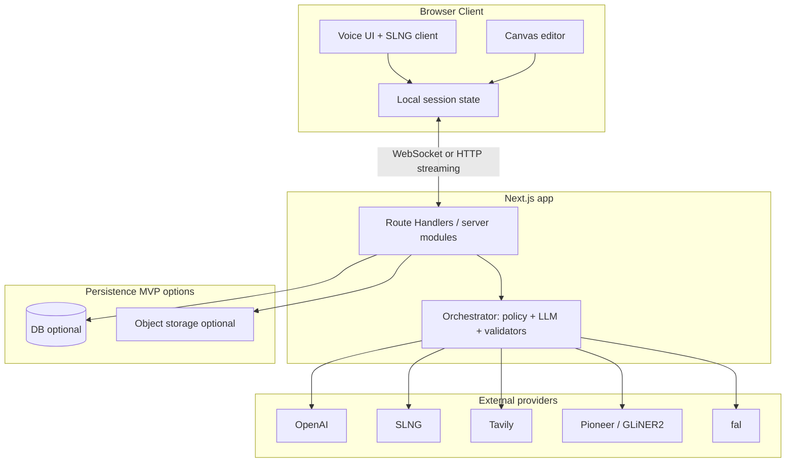
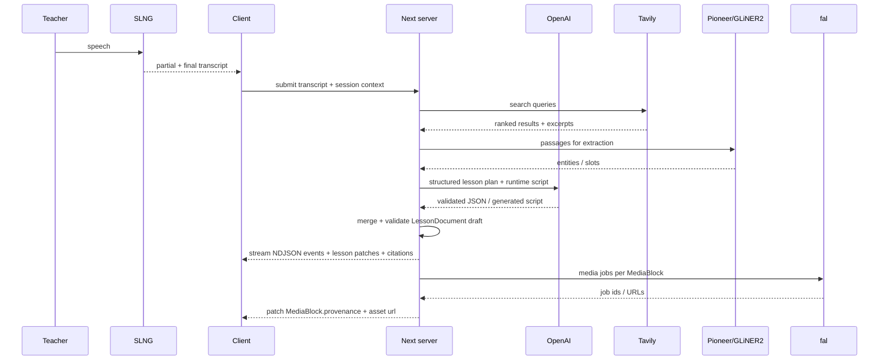
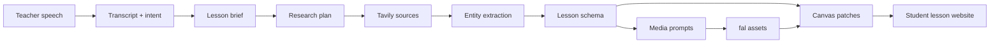
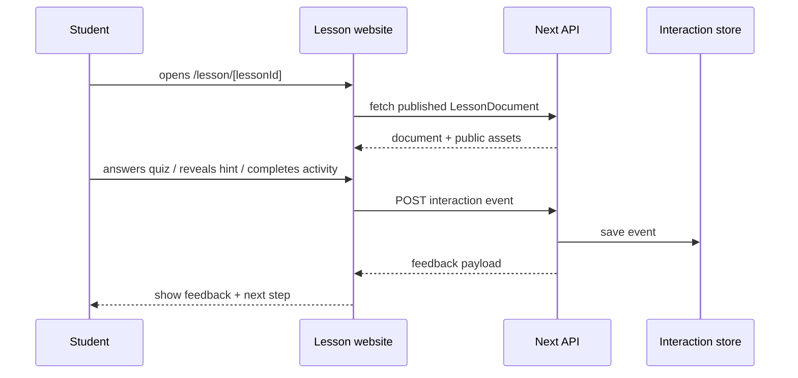
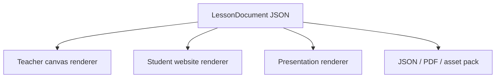

# Lumen — technical specification

**Repository:** `next-learning`  
**Document type:** technical architecture & product spec (hackathon-oriented)  
**Stack (current):** Next.js **16.2**, React **19.2**, TypeScript **5**, Tailwind **v4**, Drizzle + PostgreSQL, Vercel AI SDK, Biome via Ultracite, **pnpm**, Lefthook  
**App entry:** `src/app/` (App Router)

This document is the **authoritative technical description** of the intended system and current product direction. As of 2026-05-16, the codebase is a **provider-visible persisted demo MVP** rather than a scaffold: `/studio` can submit a lesson prompt, stream orchestration progress as NDJSON, render an editable canvas, persist generated lesson versions to PostgreSQL, and open student-facing lesson pages.

Sections marked **Target** still describe planned behavior. Implementation status should be cross-checked against `docs/CURRENT.md`.

---

## 1. Purpose & audience

### 1.1 Purpose

Align engineering, integrations, and judging criteria around a **voice-first** workflow that produces a **structured, editable multimedia lesson** on a canvas—not a static chat transcript.

### 1.2 Audience

- Implementers (frontend, backend, ML glue)
- Hackathon reviewers (clarity of architecture and provider usage)
- Future maintainers (constraints, tradeoffs, extension points)

### 1.3 Out of scope (unless explicitly added later)

- Full LMS integration (Google Classroom, Canvas LMS product, etc.)
- Multi-teacher realtime collaboration on one canvas (possible stretch; not assumed)
- Student identity management at scale
- Offline-first mobile native apps

---

## 2. Product definition

### 2.1 Product name

**Lumen**

### 2.2 One-liner

A voice-first AI web application that helps teachers create **editable multimedia teaching content** by speaking naturally.

### 2.3 Core loop (teacher experience)

1. **Speak** a lesson intent (topic, level, duration, constraints).
2. **Listen** to confirmations, clarifying questions, or summaries (voice + optional text).
3. **Observe** the canvas filling with blocks: objectives, explanations, media, activities, citations.
4. **Edit** any block (text, layout, replace media, tweak quiz items).
5. **Export or share** (format TBD: JSON bundle, PDF snapshot, link—see §10).

### 2.4 Canvas contents (first-class nodes)

| Category      | Examples                                                       | Notes                                                       |
| ------------- | -------------------------------------------------------------- | ----------------------------------------------------------- |
| Pedagogy      | Learning objectives, key takeaways, pacing / segments          | Should map to stable IDs for reordering                     |
| Narrative     | Rich text, callouts, vocabulary                                | Markdown or portable JSON; avoid vendor lock-in             |
| Media         | Images, short video clips, diagrams                            | Store **provenance** (model, prompt hash, provider job id)  |
| Audio         | Narration clips, TTS summaries                                 | Optional SLNG output; mirror to S3-compatible storage when configured |
| Interactivity | Activities, quizzes (MCQ, short answer), “check understanding” | Separate **content** from **runtime** (how it is presented) |
| Evidence      | References, quotes, “further reading”                          | Must retain **URLs + retrieved snippets** for trust         |

### 2.5 Provider roles (integration matrix)

| Provider                        | Capability               | Responsibility in this product                                                                         |
| ------------------------------- | ------------------------ | ------------------------------------------------------------------------------------------------------ |
| **OpenAI**                      | Structured generation    | Lesson JSON planning, utility generation, generated runtime script, fallback-friendly orchestration     |
| **SLNG**                        | STT, TTS, realtime voice | Primary **human interface**; low-latency feedback; partial transcripts for UI                          |
| **Tavily**                      | Web-aware search         | Retrieve **fresh** supporting material; reduce model hallucination for factual subjects                |
| **Pioneer (Fastino) / GLiNER2** | Structured extraction    | Turn unstructured text (teacher + search results) into **typed entities** aligned to the lesson schema |
| **fal**                         | Generative media         | Produce **images/video** assets bound to specific canvas nodes                                         |
| **S3-compatible storage**        | Durable media URLs       | Optional mirror for generated images, videos, and TTS audio so shared lessons do not depend on ephemeral provider URLs |

### 2.6 Product summary & pitch (hackathon)

**One-paragraph product:** A teacher speaks a lesson request. The app transcribes the voice (**SLNG**), researches supporting material (**Tavily**), extracts a structured lesson schema (**Pioneer / GLiNER2**), generates images and a short video (**fal**), and assembles everything into an **editable canvas** with text, image, video, quiz, and activity blocks. The teacher can then speak follow-up commands (“make it shorter,” “add a group activity,” “change the image style”) and the canvas updates live. Final output: **save** or **export**.

**Pitch line (judges / sticky note):** *“Other AI tools give teachers a wall of text. We give them an editable, multimedia lesson canvas — and they build it with their voice in 90 seconds.”*

**Spoken pitch skeleton (optional, ~30s):** Teachers spend hours preparing materials for a short class. We compress that into **voice in, lesson out** — not a wall of text, but an **editable multimedia canvas**: diagrams, short motion, quizzes, activities. Close with: *“Editable. Multimedia. Voice-first. That’s the difference.”* (Demo follows §4.6.)

**Design principle:** each provider does what it is best at; **orchestration** (likely an LLM + deterministic validators on the server) merges outputs into one **canonical lesson document** (§6).

---

## 3. Goals, non-goals, and quality attributes

### 3.1 Goals (ordered)

1. **Voice-first usability:** teacher can complete a meaningful lesson draft without typing (typing is optional enhancement).
2. **Structured output:** downstream UI can render and edit without scraping Markdown blobs.
3. **Grounding:** citations and search snippets visible where claims need support.
4. **Editability:** every generated block is mutable; regenerating one block should not destroy unrelated content.
5. **Provider fidelity:** judges can see **clear boundaries**—when Tavily was called, what was extracted, what media job produced which asset.

### 3.2 Non-goals (hackathon realism)

- Perfect WYSIWYG parity with commercial authoring tools
- Full accessibility certification (still follow basics: keyboard, captions where video, ARIA on custom controls)
- Exhaustive subject-specific pedagogical templates on day one

### 3.3 Quality attributes

| Attribute            | Target                            | Implementation lever                                                                    |
| -------------------- | --------------------------------- | --------------------------------------------------------------------------------------- |
| **Latency (voice)**  | Perceived continuous conversation | Streaming STT; short TTS replies; async canvas updates                                  |
| **Latency (canvas)** | Progressive disclosure            | Render “skeleton blocks” immediately; fill media as jobs complete                       |
| **Reliability**      | Partial success is acceptable     | Per-node job status: `pending` / `ready` / `failed` with retry                          |
| **Safety**           | Teacher-facing                    | Server-side tool allowlists; URL validation; optional moderation pass on generated text |
| **Auditability**     | Demo-friendly                     | Persist `GenerationRun` metadata: prompts, queries, timestamps, provider ids            |

---

## 4. Personas & critical journeys

### 4.1 Primary persona: classroom teacher

- Expert in subject; limited time; wants **materials** not a chatbot.
- May speak in **fragments**, revise verbally (“actually for grade 9, not 10”).

### 4.2 Secondary persona: instructional coach / curriculum lead

- Cares about **objectives alignment**, citations, and reuse across classes.

### 4.3 Critical journeys

**J1 — Happy path generation**

Speak intent → clarifying questions (if needed) → Tavily searches → extraction/schema merge → fal jobs for visuals → canvas populated → teacher tweaks text.

**J2 — Correction loop**

Teacher selects a block → “regenerate this image / simplify this paragraph” → single-node pipeline re-run without full lesson rebuild.

**J3 — Trust check**

Teacher opens “sources” drawer on a factual block → sees Tavily hits + excerpts + links.

### 4.4 Narrative scenario — “Mai” (primary)

**Persona:** Mai — middle-school science teacher, ~20 minutes between classes, needs a **water cycle** lesson for tomorrow.

**Flow (target UX):**

1. Opens the app → clean **home** with one primary CTA: *“What do you want to teach today?”* and a **large microphone** (see §9.5).
2. Taps mic, speaks the full lesson request (topic, duration, grade, requested blocks: diagram, short animation, real-life example, quiz count).
3. **Live transcript** appears as she speaks; on stop, **TTS** (optional but demo-strong): *“Got it. English, or bilingual?”* — she answers *English*.
4. **Right side** fills **progressively**: research status card → canvas **skeleton** with placeholders → **image** resolves → **video** resolves (never a long empty screen; see §9.5 progressive reveal).
5. Voice edit: *“Make the explanation shorter and add a 3-minute group activity.”* — text updates **in place**; new **activity** block appears.
6. Voice edit: *“Make the image friendlier for younger students.”* — **regenerate** image (same block id, new asset).
7. **Export** → PDF download (nice-to-have; see cut-line §16.1 if time runs out).

**Demo KPIs (story, not a hard requirement):** ~3 minutes wall-clock; **minimal clicks** (e.g. mic → mic → export) to reinforce voice-first.

### 4.5 Defensive UX (edge cases)

| Situation | Target behavior |
| --------- | ---------------- |
| **Mic permission denied** | Prominent **text input** (textarea) with the **same** downstream pipeline; label explains “Voice blocked — type your lesson request.” |
| **SLNG unavailable / slow / timeout** | Banner: *“Voice unavailable — type your request.”*; disable mic; keep orchestration path identical. |
| **fal image (or video) fails** | Block stays in **failed** state with **Retry**; **do not** block rest of canvas or other media jobs. |
| **Off-topic voice (“what’s the weather?”)** | Short **TTS or text** reply: scope is lesson content only; suggest phrases like *“add a quiz”* or *“make it shorter.”* |
| **Stage Wi‑Fi** | Pre-seeded **fallback assets** for the hero demo topic (e.g. water cycle image/video URLs); optional “fast template” mode (see §15). |

### 4.6 Live demo script (~90 seconds)

Use this as the **rehearsed** spine; adjust timestamps to team pacing.

| Time | Beat | What judges see / hear |
| ---- | ---- | ------------------------ |
| 0:00–0:10 | Hook | Home / workspace; opening line: teachers spend hours on materials → **90 seconds of voice**. |
| 0:10–0:30 | Voice in | Speak lesson request; **transcript** streams or appears on stop. |
| 0:30–1:00 | Magic | Canvas **progressive fill**: skeleton → text blocks → **image** → **video** (or placeholder + resolve). |
| 1:00–1:20 | Edit | Voice: *“Add a group activity”* + *“make the image friendlier”* — visible delta on canvas. |
| 1:20–1:30 | Close | **Export** (PDF or JSON); closing line: *“Editable. Multimedia. Voice-first. That’s the difference.”* |

**Backup:** screen recording of the full path if live APIs fail mid-demo.

---

## 5. System architecture

### 5.1 Logical view



**Rationale:** secrets and provider orchestration stay **server-side** (`Route Handlers`, server actions, or dedicated server modules). The browser holds **session UI state** and **references** to assets; it never holds provider API keys.

### 5.2 Deployment view (current default)

- **Vercel** (or compatible) for Next.js hosting.
- **Database:** PostgreSQL is required for the current persisted generation flow because `DATABASE_URL` is used by `getDb()`.
- **Media:** fal-hosted URLs by default; optional S3-compatible object storage mirrors generated images, videos, and SLNG audio for stable `https` URLs.

### 5.3 Voice vs canvas coupling

- **Tight coupling at UX:** teacher should see partial STT and which block is “targeted.”
- **Loose coupling at code:** voice session state machine ≠ canvas document reducer; bridge via explicit events (`IntentRecognized`, `ClarificationNeeded`, `LessonPatchProposed`).

---

## 6. Domain model (canonical lesson document)

### 6.1 Design criteria

- **JSON-serializable** for export, undo stacks, and AI patching.
- **Stable `id`s** on every node (UUID v4 or ULID).
- **`schemaVersion`** on the root for migrations.
- **Separation:** `LessonDocument` (content tree) vs `GenerationRun` (provenance logs).

### 6.2 Illustrative type sketch (TypeScript-ish, not implemented)

```typescript
type NodeId = string;

type BaseNode = {
  id: NodeId;
  type: string;
  title?: string;
  children?: NodeId[];
  style?: Record<string, unknown>;
};

type TextBlock = BaseNode & {
  type: "text";
  format: "markdown" | "plain";
  body: string;
};

type MediaBlock = BaseNode & {
  type: "media";
  modality: "image" | "video";
  alt: string;
  asset: { url: string; mime: string; width?: number; height?: number };
  provenance: {
    provider: "fal";
    model?: string;
    jobId?: string;
    prompt?: string;
    createdAt: string;
  };
};

type Citation = {
  id: string;
  url: string;
  title?: string;
  excerpt: string;
  retrievedAt: string;
  provider: "tavily";
};

type QuizBlock = BaseNode & {
  type: "quiz";
  items: Array<{
    id: string;
    stem: string;
    choices?: string[];
    answer?: string;
  }>;
};

type LessonDocument = {
  schemaVersion: 1;
  root: NodeId;
  nodes: Record<NodeId, TextBlock | MediaBlock | QuizBlock | BaseNode>;
  citations: Citation[];
};
```

**Note:** real implementation should use discriminated unions + Zod (or similar) for runtime validation at API boundaries.

### 6.3 Patch semantics (for AI + user edits)

Prefer **JSON Patch** or a small custom op log:

- `AddNode`, `UpdateNode`, `MoveNode`, `DeleteNode`, `SetMediaStatus`

Benefits: targeted regeneration, easier undo, clearer concurrency story than “replace whole JSON.”

---

## 7. Pipelines & orchestration

### 7.1 Orchestration philosophy

Use a **hybrid** approach:

1. **Deterministic** steps: validate URLs, normalize citations, enforce max sizes, attach provider job ids.
2. **Model-driven** steps: turn speech + context into search queries; map extracted entities into nodes; author quiz stems.

Guardrails: **schema validation** after every model step; repair loop (single retry) on validation failure.

### 7.2 Sequence: end-to-end generation (current + target)



### 7.3 Tavily integration (technical considerations)

- **Query planning:** separate queries for “definitions”, “examples”, “common misconceptions”, “classroom activities.”
- **Deduplication:** canonicalize URLs; merge overlapping excerpts.
- **Safety:** fetch only `https:`; block private IP ranges if any redirect risk; cap response size.
- **Caching:** short TTL cache keyed by query hash to survive demo retries.

### 7.4 Pioneer / GLiNER2 integration

- **Implementation references:** [Pioneer REST API overview](https://docs.pioneer.ai/api-reference/overview) and [fastino-ai/GLiNER2](https://github.com/fastino-ai/GLiNER2).
- **Input:** bounded text (teacher transcript + selected Tavily excerpts), not the whole web.
- **Output contract:** map to **slots** in your schema (e.g., `VocabularyTerm[]`, `KeyConcept[]`, `Misconception[]`).
- **Failure mode:** if extraction is thin, fall back to LLM-only structuring but **flag** lower confidence in UI.

### 7.5 fal integration

- **Async first:** return `jobId`, show spinner on node; complete with URL.
- **Idempotency:** tie job request to `MediaBlock.id` + `prompt` hash to avoid duplicate spend on retries.
- **Formats:** prefer formats the canvas can preview (mp4/h264 for video; webp/png for images).
- **Rights:** surface that media is **AI-generated** in provenance metadata (and UI where appropriate).

### 7.6 SLNG integration

- **Modes:** push-to-talk vs always-on—start with push-to-talk for cleaner demos.
- **Barge-in:** if supported, cancel in-flight TTS when user speaks.
- **Client audio:** use browser APIs with explicit permission UX; echo cancellation notes for laptop mics.
- **Transcript ownership:** store transcript segments in `GenerationRun` for reproducibility.

### 7.7 Detailed lesson generation flow

The core technical challenge is not “generate text.” It is turning a loose spoken request into a **teachable, inspectable, interactive website**. The pipeline should be staged so every stage produces a typed artifact that the next stage can validate.



| Stage                       | Input                  | Output                                          | Why it matters                                                                       |
| --------------------------- | ---------------------- | ----------------------------------------------- | ------------------------------------------------------------------------------------ |
| **1. Voice capture**        | Teacher speech         | Transcript segments with timestamps             | Keeps the product voice-first and auditable.                                         |
| **2. Intent parsing**       | Transcript             | `LessonBrief`                                   | Converts natural language into constraints: topic, grade, duration, language, style. |
| **3. Research planning**    | `LessonBrief`          | Tavily query set                                | Searches should be purposeful, not one generic query.                                |
| **4. Source retrieval**     | Query set              | Ranked source cards                             | Creates factual grounding and references.                                            |
| **5. Extraction**           | Transcript + excerpts  | Concepts, people, places, terms, misconceptions | Pioneer / GLiNER2 creates structured slots for lesson building.                      |
| **6. Pedagogical planning** | Brief + entities       | Learning path                                   | Decides sequence: hook, explanation, examples, practice, quiz, reflection.           |
| **7. Media planning**       | Learning path          | Image/video prompts                             | Generates assets that serve a teaching goal, not decoration.                         |
| **8. Canvas patching**      | Lesson schema + assets | Incremental UI patches                          | The teacher sees progress while long tasks continue.                                 |
| **9. Student runtime**      | Final `LessonDocument` | Interactive website                             | Students can learn, answer, reveal hints, and receive feedback.                      |

### 7.8 How to make the lesson vivid

A generated lesson should feel like a guided classroom activity. The system should intentionally create **moments**, not only content blocks.

| Lesson moment           | Generated block                                                        | Interaction pattern                                      |
| ----------------------- | ---------------------------------------------------------------------- | -------------------------------------------------------- |
| **Hook**                | Short scenario, surprising question, image, animation, or video teaser | Student predicts before explanation.                     |
| **Explain**             | Small chunks of text with diagrams                                     | Progressive reveal; do not show everything at once.      |
| **Example**             | Worked example with steps                                              | Student can reveal one step at a time.                   |
| **Practice**            | Mini task or drag/drop classification                                  | Immediate feedback after attempt.                        |
| **Check understanding** | 1-3 quiz questions                                                     | Show explanation, not only correct/incorrect.            |
| **Reflect**             | Exit ticket prompt                                                     | Student writes a short answer; teacher can review later. |

Media generation should be tied to pedagogy:

- Image prompts should include **subject, classroom level, visual purpose, style, labels, and safety constraints**.
- Video prompts should be used for **processes over time**: science phenomena, historical timeline, geometry transformation, language conversation.
- If a media block cannot be generated in time, the lesson should still work with a placeholder diagram or text fallback.

### 7.9 Student interaction event flow

Student interaction is a separate runtime layer on top of the lesson document. The same `LessonDocument` can be rendered in teacher edit mode or student learn mode.



Interaction should be modeled as events instead of mutating the lesson itself:

```typescript
type StudentInteractionEvent = {
  id: string;
  lessonId: string;
  nodeId: string;
  anonymousStudentId: string;
  type:
    | "quiz_answered"
    | "hint_revealed"
    | "activity_completed"
    | "reflection_submitted"
    | "media_played";
  payload: Record<string, unknown>;
  createdAt: string;
};
```

This keeps lesson content stable while still allowing analytics such as “70% of students missed question 2” or “most students replayed the video twice.”

### 7.10 Hackathon provider tuning (latency, fallbacks, prizes)

- **Tavily:** prefer `max_results: 3` and shallow `search_depth` for speed; show **count** in UI (“3 references found”) even if the visible references block is cut for time (§15.1).
- **fal:** use the official serverless client where applicable; lower **poll interval** for queued jobs; **pre-warm** with a tiny dummy request on app load to reduce first-call cold start. For stage demos, **pre-generate** hero-topic image/video URLs and **swap in silently** if live generation exceeds a budget (e.g. 15s). **Stretch:** chain image→short video, or a style LoRA for consistent “classroom poster” look — only after the baseline image path is reliable.
- **Pioneer / GLiNER2:** extraction SHOULD visibly drive at least one block (e.g. **Key terms**) so judges see structured extraction; if integration exceeds ~45 minutes, fall back to LLM-only entity extraction and document the tradeoff (prize vs. ship).
- **SLNG:** prefer **streaming** transcript UX when the API supports it; **TTS** for one clarifying question is high-impact but **cuttable** if time-constrained.

---

## 8. API & server design (Next.js)

### 8.1 Surface area (recommended)

| Surface                                         | Use for                                                   |
| ----------------------------------------------- | --------------------------------------------------------- |
| **Route Handlers** (`src/app/api/.../route.ts`) | Provider proxies, webhooks from fal, streaming generation |
| **Server Actions**                              | Form-like mutations if simplicity wins over HTTP caching  |
| **Server-only modules**                         | Shared orchestration, Zod schemas, logging                |

**Rule:** no provider SDK imports in client components.

Current implemented HTTP surfaces:

| Method & path | Purpose |
| ------------- | ------- |
| `POST /api/generate` | NDJSON lesson generation stream; persists lesson/version/run records |
| `POST /api/media` | Regenerate image or video media for a block |
| `GET /api/audio`, `POST /api/audio` | SLNG TTS bytes or S3 redirect where available |
| `POST /api/voice/transcribe` | Server-side SLNG STT endpoint |
| `POST /api/openai` | Text, JSON, and code utility generation |
| `GET /api/lessons` | Saved lesson list |
| `GET /api/lessons/[lessonId]` | Persisted lesson and current version |
| `POST /api/lessons/[lessonId]/regenerate` | Refreshed lesson JSON |

### 8.2 Streaming to the client

Current implementation uses an **NDJSON** stream from `POST /api/generate`: one JSON object per line. The studio parses `StreamEvent` objects including `run_started`, provider lifecycle events, `lesson_patch`, `lesson_snapshot`, `run_completed`, and `run_failed`.

Target options remain:

- **NDJSON** stream: one JSON object per line (`patch`, `log`, `error`).
- **SSE:** event types for patches vs telemetry; **concrete lesson-orchestration event names** are specified in §8.4.

Either way, the client reducer applies patches to **canvas state**.

### 8.3 Webhooks

If fal supports callbacks, a dedicated **unauthenticated → authenticated** path must verify signatures (provider-specific). Never expose raw webhook secrets to the client.

### 8.4 Orchestrator streaming contract (SSE, hackathon target)

For the **lesson creation workspace**, the server orchestrator SHOULD stream **discrete progress events** so the canvas can **progressively reveal** without a single long spinner. **SSE** (or semantically equivalent NDJSON) is preferred over “one JSON blob at the end.”

**Recommended route:** `POST /api/lesson/orchestrate` (or equivalent) with `Content-Type: text/event-stream`.

**Suggested event types** (names are stable contracts for the client reducer):

| SSE `event`     | Payload (JSON `data`) | Purpose |
| --------------- | --------------------- | -------- |
| `planned`       | `{ intent: … }`       | Voice-to-intent / lesson brief validated. |
| `researched`    | `{ references: … }`   | Tavily results available (may still run in parallel with schema). |
| `schema`        | `{ entities: … }`     | GLiNER2 / Pioneer extraction merged. |
| `canvas_init`   | `{ elements: … }`     | Skeleton canvas: blocks with placeholders, prompts, and **stable block ids**. |
| `canvas_patch`  | `{ patch: … }`        | Optional incremental JSON Patch for late-arriving text tweaks. |
| `media`         | `{ blockId, type, url?, status?, error? }` | Per-block fal completion or failure. |
| `error`         | `{ code, message, recoverable? }` | User-visible or toast; client may fall back to typed flow. |
| `done`          | `{}` or `{ lessonId }` | Run complete; client may trigger TTS summary. |

**Orchestration note:** for **latency**, Tavily search and GLiNER2 extraction MAY run **in parallel** after `planned`; emit `researched` / `schema` as each completes (order not guaranteed—client should merge by event type, not assume sequence).

**Voice edits (post-canvas):** a separate **`POST /api/canvas/update`** (non-streaming or short SSE) applies **JSON Patch** (§6.3) from a dedicated “canvas edit” prompt; keep orchestration paths distinct from initial generation.

---

## 9. Client architecture

### 9.1 Component boundaries (suggested)

- **`VoiceSessionController` / `VoicePanel`:** mic, SLNG connection, transcript state, speaking indicators, status list, quick actions (§9.5).
- **`CanvasWorkspace`:** layout, selection, drag-drop, inspector panel.
- **`BlockRenderer`:** per-type renderers (`TextBlockEditor`, `MediaBlockPreview`, `QuizEditor`).
- **`SourcesDrawer`:** citations grouped by node.

### 9.2 React / Next split

- **Server Components** for marketing/settings/static shells.
- **Client Components** for canvas, voice, streaming patches (React 19 concurrent features help with smooth updates).

### 9.3 Undo / redo

- Command stack on client for user edits.
- **Do not** undo provider jobs retroactively; undo restores **pointers and text**, not “unburn” API cost.

### 9.4 Student lesson runtime

The student-facing website should not expose the full editing canvas. It should render the same underlying content as a **guided lesson experience**.

Recommended route split:

| Route                            | Audience          | Purpose                                          |
| -------------------------------- | ----------------- | ------------------------------------------------ |
| `/studio/[lessonId]`             | Teacher           | Edit canvas, regenerate blocks, inspect sources. |
| `/lesson/[lessonId]`             | Student           | Learn through the generated interactive website. |
| `/present/[lessonId]`            | Teacher/classroom | Full-screen presentation mode.                   |
| `/api/lessons/[lessonId]`        | App               | Load/publish lesson data.                        |
| `/api/lessons/[lessonId]/events` | App               | Record student interactions.                     |

Student runtime components:

- **`LessonPageShell`**: loads public lesson data and renders navigation.
- **`LessonProgress`**: section progress, completion state, current step.
- **`InteractiveBlockRenderer`**: renders student-safe block variants.
- **`QuizRuntime`**: answer selection, validation, explanation.
- **`ActivityRuntime`**: drag/drop, ordering, matching, classification, or short response.
- **`ReflectionPrompt`**: captures open-ended response.
- **`SourcePopover`**: shows short citations when factual claims need trust.

Teacher edit components and student runtime components should share schema types but not UI state. This avoids leaking draft-only controls into the public lesson.

### 9.5 UX & UI specification — Lesson Workspace (demo-critical)

This subsection is the **authoritative visual + interaction spec** for the hackathon demo surface. It aligns the **spatial layout**, **motion design**, and **voice vs edit** routing described in §4.4–§4.6.

#### 9.5.1 Information architecture

| Surface | Role |
| ------- | ---- |
| **Home / dashboard** | Minimal for MVP: primary question *“What do you want to teach today?”*, **large mic**, optional template shortcuts; list of saved lessons can be stubbed. |
| **Lesson workspace** | Single screen that carries the live demo: **voice panel** + **canvas** + top bar actions. |

**Route naming:** `/studio/[lessonId]` (document default) and a thin alias such as `/workspace` (same UI) are both acceptable; pick one for links in the app and stick to it.

#### 9.5.2 Layout (two-column)

ASCII wire (widths are **targets**, not hard law):

```text
┌─────────────────────────────────────────────────────────────────┐
│  Lumen                                        [Save]  [Export]    │
├──────────────────────┬──────────────────────────────────────────┤
│  VOICE PANEL         │  CANVAS (scroll)                           │
│  ~380px fixed        │  flex-1                                    │
│  · big mic           │  · stacked “cards” (blocks) top → bottom   │
│  · transcript        │  · title, objectives, media, quiz, etc.    │
│  · status list       │  · optional “References” strip at bottom   │
│  · quick actions     │                                            │
└──────────────────────┴──────────────────────────────────────────┘
```

- **Top bar:** product name (left), **Save** + **Export** (right); keep height compact (~56–64px).
- **Voice column:** fixed width on desktop; on narrow viewports stack **voice above canvas** (voice remains first for thumb reach on mobile).

#### 9.5.3 Visual language

| Token | Target |
| ----- | ------ |
| **Page background** | Off-white / paper: `#FAFAF7` (classroom-friendly, low glare). |
| **Accent** | One warm accent only (e.g. `#FF6B35`): **mic button**, recording ring, primary CTA highlights. Avoid multi-accent rainbow UI. |
| **Surfaces** | Canvas blocks: **white** cards, `border-radius: 12px`, subtle shadow `0 1px 3px rgba(0,0,0,0.05)`, **16px** vertical gap between blocks. |
| **Typography** | **Inter** or **DM Sans**; title **~28px** semibold/bold; block headers **~18px** semibold; body **~15px** regular; line-height comfortable for reading aloud. |
| **Status** | Small colored dot + label; **in-progress** uses a slow pulse or spinner; **done** ✓; **failed** ✗ with retry affordance on the affected block. |

#### 9.5.4 Voice panel — components & motion

- **Microphone control:** large **~80px** circular button, accent fill; **tap to start / tap to stop**; **hold-to-talk** optional but recommended for deliberate demo pacing.
- **Listening state:** gentle **pulse** animation (e.g. scale 1 → 1.05, opacity or ring) while recording; optional **waveform** visualization when feasible.
- **Transcript:** stream partial tokens when SLNG supports streaming; otherwise show **full transcript on stop** with a typing-style reveal as polish.
- **Status list (vertical):** e.g. Researching → Schema → Generating image → Generating video; mirrors SSE events from §8.4.
- **Quick actions (chips):** `Add quiz`, `Shorter`, `Add activity`, `Regenerate image` — duplicate common voice commands for **booth fallback** when audio fails.

#### 9.5.5 Canvas blocks — editing & regeneration

- Each block is a **card** with an optional **hover / focus toolbar**: **Edit**, **Regenerate** (media), **Delete** (teacher-only; confirm if destructive).
- **Text:** inline edit (contentEditable or textarea) with debounced save to client store.
- **Image / video:** show **placeholder + shimmer skeleton** while `pending`; cross-fade or fade-in when `ready`; **Retry** on `failed` without blocking siblings.
- **References:** compact block or footer strip with **up to 3** links + one-line snippet each (trust + demo clarity).

#### 9.5.6 Progressive reveal (“demo magic”)

Rules:

1. After transcript submit, **never** show a blank canvas: immediately render **skeleton blocks** (titles + gray shimmer) sized like final cards.
2. Fill **text** as soon as LLM output arrives; run **fal** jobs in parallel; attach URLs to blocks as `media` events arrive.
3. Prefer **motion** (skeleton → content, fade-in) over hard pop-in.

This behavior is **product-critical** and pairs directly with the SSE contract in §8.4.

#### 9.5.7 Intent routing (same mic, two modes)

**Single mic button** for both “create lesson” and “edit canvas.” Heuristic **v1**:

- If **no canvas yet** (or empty draft) → transcript goes to **orchestrator** (`/api/lesson/orchestrate`).
- If **canvas exists** with content → transcript goes to **canvas update** (`/api/canvas/update`) as an edit command.

Ambiguity (short utterances) MAY be resolved with a lightweight classifier or LLM router; if unsure, prefer **edit** when canvas is non-empty and the utterance matches imperative patterns (“add”, “make”, “remove”, “shorter”).

#### 9.5.8 Export & save (workspace top bar)

- **Save:** persists to M0/M1 tier (§10.1); toast + optimistic UI.
- **Export:** **PDF** is a strong demo closer (html2pdf / print-to-PDF); JSON export remains the reliable engineering fallback.

### 9.6 Component file mapping (suggested)

Aligns naming with implementation tasks:

- `src/components/voice/VoicePanel.tsx` — mic, transcript, status, quick actions, waveform (optional).
- `src/components/canvas/Canvas.tsx` — scrollable column of blocks + top bar integration.
- `src/components/canvas/blocks/*` — `TextBlock`, `ImageBlock`, `VideoBlock`, `QuizBlock`, `ActivityBlock`, `ReferenceBlock`.
- `src/lib/store.ts` (or similar) — Zustand (or equivalent) for canvas + run state driven by SSE.

---

## 10. Persistence & export

### 10.1 Hackathon MVP tiers

| Tier   | What                               | Why                          |
| ------ | ---------------------------------- | ---------------------------- |
| **M0** | `localStorage` / downloadable JSON | Fast demo, no backend; currently **not** the implemented generation path |
| **M1** | Postgres + optional S3-compatible blob storage | Current persisted generation path; multi-device, shareable link |
| **M2** | Version history per lesson         | Partially present through `lesson_versions`; still needs richer UI and edit history |

### 10.2 Export formats (target)

- **`.canvaslesson.json`:** canonical document + embedded citation list.
- **Asset pack:** zip of JSON + media files with manifest (if URLs are ephemeral).

### 10.3 Can the lesson become a website?

Yes. The best product direction is: **the generated lesson is a website**.

The canvas is the authoring surface. The website is the delivery surface. Technically, both are different renderers for the same `LessonDocument`:



This creates a strong demo:

1. Teacher speaks: “Create a 20-minute lesson about photosynthesis for grade 6.”
2. App generates a canvas with sections, images, activity, quiz, and references.
3. Teacher edits one block by voice: “make this easier and add an analogy.”
4. Teacher clicks **Publish as website**.
5. Students open `/lesson/photosynthesis-grade-6` and interact with the lesson.

### 10.4 Website generation model

There are two implementation options.

| Option                       | How it works                                                          | Best for                                    |
| ---------------------------- | --------------------------------------------------------------------- | ------------------------------------------- |
| **Dynamic website**          | `/lesson/[lessonId]` fetches `LessonDocument` at request time.        | Hackathon MVP; fastest to build.            |
| **Static published website** | Publish step snapshots the document into a versioned static artifact. | Stable sharing; fewer runtime dependencies. |

Current path: generated lessons are persisted as versioned lesson records and rendered through `/lesson/[lessonId]`, with sandboxed HTML for generated artifacts and structured React rendering for fixtures/fallbacks. Dynamic structured rendering and static/sandboxed publishing remain architectural options to consolidate later.

Minimal target folder structure:

```text
src/
  app/
    studio/[lessonId]/page.tsx
    workspace/page.tsx
    lesson/[lessonId]/page.tsx
    present/[lessonId]/page.tsx
    api/lessons/[lessonId]/route.ts
    api/lessons/[lessonId]/events/route.ts
  components/
    canvas/
    lesson-runtime/
    voice/
  lib/
    lesson/
      schema.ts
      patches.ts
      render-policy.ts
    orchestrator/
      generate-lesson.ts
      providers/
        slng.ts
        tavily.ts
        pioneer.ts
        fal.ts
```

### 10.5 Generated website page anatomy

A published lesson website should have a predictable structure:

1. **Hero section:** topic, grade, duration, learning goals, generated cover image.
2. **Warm-up:** a prediction question or scenario.
3. **Concept sections:** each section has explanation, visual, example, and quick check.
4. **Interactive activity:** matching, ordering, classification, simulation-like prompt, or worksheet-style exercise.
5. **Quiz:** short formative assessment with explanations.
6. **Reflection:** “What did you learn?” or “Where would you see this in real life?”
7. **Sources:** teacher-visible or student-visible citations, depending on age and subject.

### 10.6 Interaction patterns to support first

For the MVP, prioritize interactions that are easy to generate reliably:

| Interaction          | Generated data needed                      | Student value                                                   |
| -------------------- | ------------------------------------------ | --------------------------------------------------------------- |
| Multiple choice quiz | stem, choices, correct answer, explanation | Fast comprehension check.                                       |
| Reveal hint          | hint text tied to a section                | Supports struggling students without giving answer immediately. |
| Step-by-step example | ordered steps                              | Makes reasoning visible.                                        |
| Matching pairs       | terms + definitions                        | Good for vocabulary-heavy topics.                               |
| Classification       | items + categories                         | Good for science, history, grammar, math concepts.              |
| Reflection prompt    | prompt + optional rubric                   | Encourages transfer and metacognition.                          |

The system should avoid complex games in the first version. Simple interactions with immediate feedback are more reliable and easier to auto-generate from structured lesson data.

---

## 11. Security & privacy

### 11.1 Secrets

- Store keys in environment variables / Vercel project settings.
- Rotate demo keys after hackathon.

### 11.2 Data handling

- Assume transcripts may contain **PII** (student names mentioned casually). Minimize retention; disclose in UI if stored.

### 11.3 Web & SSRF

- Validate all user-attachable URLs.
- Tavily results should still be treated as **untrusted content** until sanitized for display (e.g., Markdown XSS if rendering unsafely).

### 11.4 Rate limiting

- Per-IP or per-session limits on generation endpoints to prevent abuse of paid APIs.

---

## 12. Observability & operations

- **Structured logs:** `runId`, `sessionId`, `nodeId`, `provider`, `latencyMs`, `outcome`.
- **Cost visibility (dev):** optional footer in dev mode showing approximate token/job usage (never in student-facing prod without thought).

---

## 13. Testing strategy

| Layer              | Focus                                               |
| ------------------ | --------------------------------------------------- |
| **Unit**           | Zod schema validation, patch reducer, URL sanitizer |
| **Contract**       | Fixture JSON from each provider mocked              |
| **E2E (optional)** | Playwright: mock voice path with text injection     |

---

## 14. Implementation roadmap (suggested)

1. **Foundation:** canonical `LessonDocument` types + patch reducer + empty canvas UI.
2. **Student website renderer:** render a sample `LessonDocument` at `/lesson/[lessonId]` before adding AI.
3. **Text-only generation path:** transcript in → lesson plan out → blocks + interactions.
4. **Add Tavily:** citations pane + grounded text blocks.
5. **Add extraction:** Pioneer/GLiNER2 fills structured slots; compare with LLM-only baseline.
6. **Add fal:** image per section; then video where time allows.
7. **Add SLNG:** replace typed transcript with real voice for demo path.
8. **Publish flow:** teacher clicks “Publish as website” and receives a shareable lesson URL.

This order de-risks the hackathon: **canvas + orchestration** first, **voice** last (most variable in booth conditions).

### 14.1 Hackathon time-boxed build plan (~5 hours)

Ordered so each step is **individually demoable**; if time runs out, the demo degrades gracefully (see §15.1).

| Step | Time (guide) | Outcome |
| ---- | ------------- | -------- |
| **0 — Setup** | ~20 min | Next.js + Tailwind + env stubs (`SLNG_*`, `TAVILY_*`, `FAL_*`, `FASTINO_*`, LLM key); deps such as `uuid`, client store, optional SSE parser. |
| **1 — Static canvas** | ~40 min | `Canvas` + block components + **mock** `LessonDocument` (water cycle) matching §9.5 layout and styling. |
| **2 — Voice in** | ~45 min | `VoicePanel` + `MediaRecorder` → `POST /api/voice/transcribe` → SLNG; transcript UI. |
| **3 — Orchestrator + SSE** | ~50 min | `POST /api/lesson/orchestrate` streams §8.4 events; client updates store; **parallel** Tavily + GLiNER2 after `planned`. |
| **4 — fal media** | ~40 min | Image + optional video; placeholders + retries; pre-baked fallbacks for stage. |
| **5 — GLiNER2** | ~30 min | Wired extraction feeding at least **Key terms** block; LLM fallback documented. |
| **6 — Voice edit** | ~40 min | `POST /api/canvas/update` + JSON Patch; **pre-bake** 2–3 commands for the demo script (§4.6). |
| **7 — Tavily polish** | ~20 min | References strip + voice-panel research line. |
| **8 — PDF export** | ~20 min | html2pdf / print route — demo closer. |
| **9 — Rehearsal** | ~25 min | Three full dry runs + backup screen recording. |

**Note:** §14 numbered list above is the **de-risked engineering order** (student renderer early, voice later). §14.1 is the **time-boxed booth sprint**; teams may blend both.

---

## 15. Risks & mitigations

### 15.1 Hackathon cut-line (drop order)

When behind schedule, **drop in this order** (first dropped = lowest demo risk relative to effort):

1. Visible **References** block on canvas (keep Tavily running **silently** to ground the LLM if already wired).
2. **PDF export** → replace with “Saved!” toast + JSON download.
3. **Arbitrary voice editing** → keep **quick-action chips** (§9.5.4) that fire the same patch paths.
4. **Video generation** → placeholder + copy “generating in background”; rely on **image** for the visual win.
5. **Pioneer / GLiNER2** → LLM-only extraction (lose structured-extraction prize angle; keep ship).

**Never cut for the core story:** SLNG (or typed fallback), **fal image** (or credible pre-seeded asset), **canvas + progressive reveal**, and a **coherent orchestration narrative** (even if simplified).

| Risk                                  | Mitigation                                                 |
| ------------------------------------- | ---------------------------------------------------------- |
| Voice unreliable on conference Wi-Fi  | Text fallback; pre-recorded demo clip                      |
| Provider latency blows demo           | Pre-seed a run; live mode toggles “fast template”          |
| Schema thrash                         | Versioned schema + strict validation                       |
| Copyright / licensing on web excerpts | Tavily excerpts as short quotes; never paste full articles |

---

## 16. Open decisions (ADRs to write)

- **Orchestration model:** single “mega-prompt” vs staged sub-agents.
- **Canvas tech:** custom React layout vs embedded SDK (e.g., tldraw, Excalidraw) for positioning.
- **Auth:** anonymous sessions vs magic link for M1 persistence.

---

## 17. Repository layout (current)

- `src/app/api/**` — Route Handlers for generation, media, audio, voice, OpenAI utilities, and lessons.
- `src/app/studio/` — teacher workspace for prompt input, NDJSON consumption, provider timeline, canvas, save/share flow.
- `src/app/lessons/` and `src/app/lesson/[lessonId]/` — saved lesson browsing and student-facing lesson pages.
- `src/components/**` — UI, canvas, voice, and lesson runtime components.
- `src/db/**` — Drizzle schema and database client for `lessons`, `lesson_versions`, and `generation_runs`.
- `src/lib/lesson/**` — canonical schema, patches, repository, studio state, HTML artifact helpers.
- `src/lib/orchestrator/**` — `generate-lesson` stream and provider adapters for OpenAI, Tavily, Pioneer, fal, and SLNG.
- `src/lib/media/**` — optional S3-compatible media mirroring.
- `docs/**` — project spec, current state, and delivery plan.
- `imgs/**` — README screenshots, logo, and architecture diagram.

---

## 18. Local development

```bash
pnpm install
pnpm dev
```

Open `http://localhost:3000`.

Format / lint (Biome via Ultracite):

```bash
pnpm run format
```

**Next.js note for implementers:** this project uses a **non-standard Next.js** line per `AGENTS.md`. Before relying on framework behavior, read the guides shipped with this version under `node_modules/next/dist/docs/` and follow deprecation notices.

---

## 19. AGENTS.md (canonical agent rules)

Automation and coding agents must follow the root **`AGENTS.md`**. Duplicated below for convenience; if anything conflicts, **`AGENTS.md` at the repository root wins**.

```markdown
<!-- BEGIN:nextjs-agent-rules -->

# This is NOT the Next.js you know

This version has breaking changes — APIs, conventions, and file structure may all differ from your training data. Read the relevant guide in `node_modules/next/dist/docs/` before writing any code. Heed deprecation notices.

<!-- END:nextjs-agent-rules -->
```

---

## 20. Related files

| File              | Purpose                              |
| ----------------- | ------------------------------------ |
| `AGENTS.md`       | Agent rules (Next.js version caveat) |
| `CLAUDE.md`       | Points to `@AGENTS.md`               |
| `README.md`       | User-facing product, setup, API, and architecture overview |
| `docs/PROJECT.md` | This technical specification         |

---

## 21. Glossary

| Term               | Meaning                                                                                     |
| ------------------ | ------------------------------------------------------------------------------------------- |
| **Canvas**         | The spatial or structured workspace of lesson blocks (not necessarily infinite whiteboard). |
| **Orchestrator**   | Server-side logic coordinating LLM + providers + validation.                                |
| **Generation run** | One traced execution from user intent to settled canvas state.                              |
| **Patch**          | A small, validated change to the lesson document.                                           |
